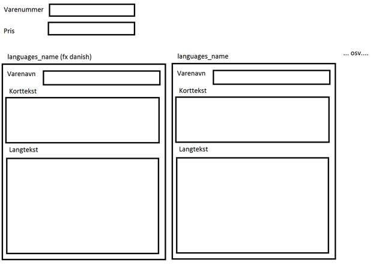

"Hej Fadil

 

Tak for din ansøgning vedrørende stillingen som IT-udvikler.

Din ansøgning var utrolig spændende og jeg vil rigtig gerne give dig en lille prøve opgave, som du kan arbejde med hjemmefra.

 

Jeg vil gerne have dig til at lave oprettelse, sletning og redigering af produkter i en database. Jeg har lavet et test setup som er vedhæftet.

 

Du skal lave en liste over produkterne, hvor der vises (bare sæt det op i en tabel):

 

Redigerknap som skal lede til redigeringssiden.

Slet knap som skal slette produkterne, gerne hvor man skal bekræfte før sletningen.

Varenavn (vis altid den danske da $default_languages_id = 1;)

Pris

Varenummer

 

Der ud over skal der være en redigeringsside hvor man kan indtaste nogle faste værdier (varenummer og pris) og nogle variable (produktnavn, kort beskrivelse og langbeskrivelse). Som dette:

Du skal sætte korttekst og langtekst op med en WYSIWYG-editor.

 

Hvis jeg tilføjer et sprog mere i languages, så skal der komme en boks mere ved siden af de 3, som der som standard vil komme frem, fordi der er oprette 3 sprog.

Ud over rediger siden, så skal der være en opret produktside til nye produkter. Genbrug gerne så meget fra rediger siden som overhovedet muligt (måske kan du bruge samme fil og bare skelne rediger fra opret ved at lave en GET variable).

 

Derudover vil jeg rigtig gerne at du tager tid på hvor lang tid du bruger på projektet.

Jeg vil hellere have at alt virker og det er godt lavet, end det bliver lavet hurtigt og sjusket.

Projektet skal laves i PHP."

 
